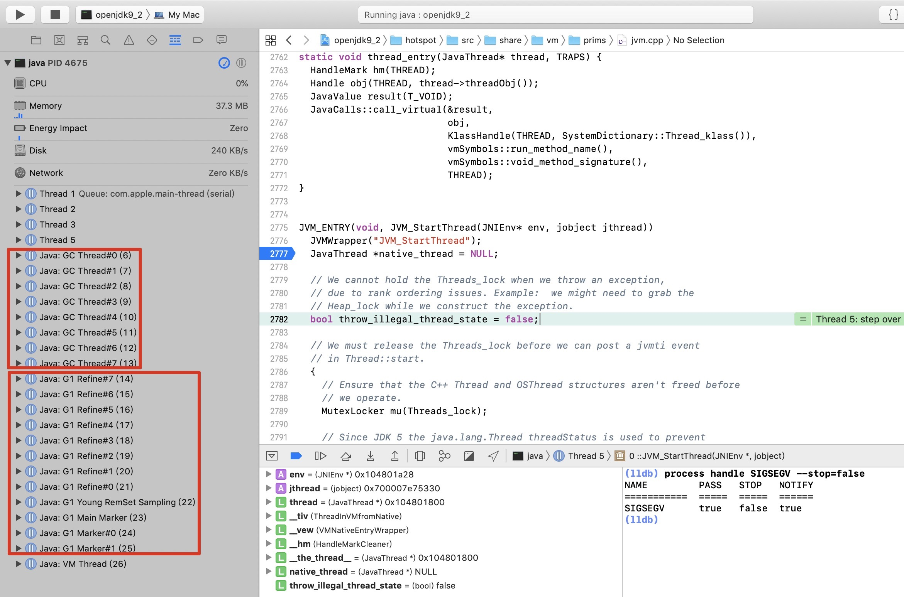

# Java线程学习(一) -- 从Java启动线程到JVM

## 环境
#### 操作系统：MacOS Mojave (10.14.5)
#### JDK版本：OpenJDK9
#### IDE：XCode9
#### OpenJDK编译和调试环境：-

## 测试程序
```java
public class ThreadTest {

    public static void main(String[] args) {
        MyThread thread = new MyThread();
        thread.start();
    }

}

class MyThread extends Thread {

    @Override
    public void run() {
        System.out.println("tid: " + Thread.currentThread().getId());
    }
}
```

## 调试过程

main.c中的main()是Java程序的执行入口，执行参数的前置处理，命令行参数处理，然后启动JVM的线程，启动包括N个GC线程。JDK9默认启动的是G1线程，在调试中可以注意到os_bsd.cpp文件中的这一行
```c++
    osthread->set_thread_type(thr_type);
```
找到对应的头文件，os.hpp 可以看到thr_type是一个枚举，定义如下
```c++
    enum ThreadType {
        vm_thread,
        cgc_thread,        // Concurrent GC thread
        pgc_thread,        // Parallel GC thread
        java_thread,       // Java, CodeCacheSweeper, JVMTIAgent and Service threads.
        compiler_thread,
        watcher_thread,
        os_thread
  };
```
OpenJDK9的JVM在启动过程中创建了N个(数了下启动了8个GC线程和12个G1线程)G1和GC线程，thr_type分别是 pgc_thread(代表G1)和cgc_thread(代表GC)。完成后，虚拟机会开始创建Java线程，此时thr_typ是java_thread。



### JVM创建线程代码(os_bsd.cpp)
```c++
bool os::create_thread(Thread* thread, ThreadType thr_type,
                       size_t req_stack_size) {
  assert(thread->osthread() == NULL, "caller responsible");

  // Allocate the OSThread object
  // 为系统线程对象分配空间
  OSThread* osthread = new OSThread(NULL, NULL);
  if (osthread == NULL) {
    return false;
  }

  // set the correct thread state
  // thr_type如上所述，此时创建java线程，thr_type = java_thread
  osthread->set_thread_type(thr_type);

  // Initial state is ALLOCATED but not INITIALIZED
  // 此时线程处于分配状态
  osthread->set_state(ALLOCATED);
  // 把创建好的系统线程对象绑定到Java Thread所在的内存地址
  thread->set_osthread(osthread);

  // init thread attributes
  // 设置线程属性
  pthread_attr_t attr;
  pthread_attr_init(&attr);
  // 设置线程为分离状态
  pthread_attr_setdetachstate(&attr, PTHREAD_CREATE_DETACHED);

  // calculate stack size if it's not specified by caller
  // 给线程设置堆栈空间
  size_t stack_size = os::Posix::get_initial_stack_size(thr_type, req_stack_size);
  pthread_attr_setstacksize(&attr, stack_size);

  ThreadState state;

  {
    pthread_t tid;
    // 调用pthread_create库函数创建内核线程，线程的运行函数是thread_native_entry，同时把thread作为参数传入方法
    int ret = pthread_create(&tid, &attr, (void* (*)(void*)) thread_native_entry, thread);

    char buf[64];
    if (ret == 0) {
      log_info(os, thread)("Thread started (pthread id: " UINTX_FORMAT ", attributes: %s). ",
        (uintx) tid, os::Posix::describe_pthread_attr(buf, sizeof(buf), &attr));
    } else {
      log_warning(os, thread)("Failed to start thread - pthread_create failed (%s) for attributes: %s.",
        os::errno_name(ret), os::Posix::describe_pthread_attr(buf, sizeof(buf), &attr));
    }
    //结束后释放线程属性对象
    pthread_attr_destroy(&attr);

    if (ret != 0) {
      // Need to clean up stuff we've allocated so far
      thread->set_osthread(NULL);
      delete osthread;
      return false;
    }

    // Store pthread info into the OSThread
    // 把子线程的线程id绑定到系统线程
    osthread->set_pthread_id(tid);

    // Wait until child thread is either initialized or aborted
    {
      Monitor* sync_with_child = osthread->startThread_lock();
      MutexLockerEx ml(sync_with_child, Mutex::_no_safepoint_check_flag);
      // 如果系统线程的状态是ALLOCATED，即子线程还没有创建成功，则循环，等待子线程唤醒。
      while ((state = osthread->get_state()) == ALLOCATED) {
        sync_with_child->wait(Mutex::_no_safepoint_check_flag);
      }
    }

  }

  // Aborted due to thread limit being reached 
  if (state == ZOMBIE) {
    thread->set_osthread(NULL);
    delete osthread;
    return false;
  }

  // The thread is returned suspended (in state INITIALIZED),
  // and is started higher up in the call chain
  assert(state == INITIALIZED, "race condition");
  return true;
}
```
##### 相关知识点参考
1. 创建线程的函数，pthread_create(&tid, &attr, (void* (*)(void*)) thread_native_entry, thread);
2. 线程分离状态。


#### 创建线程时的运行函数，thread_native_entry
在这个方法中，Java线程被设置为INITIALIZED同时调用wait等待，因为是分离状态的函数，所以它可以自己决定何时释放资源并返回，此处会由start0()对应的C++函数JVM_StartThread来发送线程的执行信号。

```c++
// Thread start routine for all newly created threads
static void *thread_native_entry(Thread *thread) {
  // Try to randomize the cache line index of hot stack frames.
  // This helps when threads of the same stack traces evict each other's
  // cache lines. The threads can be either from the same JVM instance, or
  // from different JVM instances. The benefit is especially true for
  // processors with hyperthreading technology.
  static int counter = 0;
  // 获取当前进程的pid
  int pid = os::current_process_id();
  alloca(((pid ^ counter++) & 7) * 128);

  thread->initialize_thread_current();
  // 取出从pthread_create方法传入的第四个参数，thread中的osThread
  OSThread* osthread = thread->osthread();
  Monitor* sync = osthread->startThread_lock();
  // 设置线程id
  osthread->set_thread_id(os::Bsd::gettid());

  log_info(os, thread)("Thread is alive (tid: " UINTX_FORMAT ", pthread id: " UINTX_FORMAT ").",
    os::current_thread_id(), (uintx) pthread_self());

#ifdef __APPLE__
  uint64_t unique_thread_id = locate_unique_thread_id(osthread->thread_id());
  guarantee(unique_thread_id != 0, "unique thread id was not found");
  osthread->set_unique_thread_id(unique_thread_id);
#endif
  // initialize signal mask for this thread
  os::Bsd::hotspot_sigmask(thread);

  // initialize floating point control register
  os::Bsd::init_thread_fpu_state();

#ifdef __APPLE__
  // register thread with objc gc
  if (objc_registerThreadWithCollectorFunction != NULL) {
    objc_registerThreadWithCollectorFunction();
  }
#endif

  // handshaking with parent thread
  {
    MutexLockerEx ml(sync, Mutex::_no_safepoint_check_flag);

    // notify parent thread
    //把系统线程的状态从ALLOCATED设置为INITIALIZED
    osthread->set_state(INITIALIZED);
    // 唤醒等待的父线程？
    sync->notify_all();

    // wait until os::start_thread()
    // 线程为初始化之后，调用wait，等待native start0()调用。JVM_StartThread中的Thread::start(native_thread)把线程状态从INITIALIZED变成RUNNABLE，循环跳出。
    while (osthread->get_state() == INITIALIZED) {
      sync->wait(Mutex::_no_safepoint_check_flag);
    }
  }

  // call one more level start routine
  // 线程执行run()方法中的任务
  thread->run();

  log_info(os, thread)("Thread finished (tid: " UINTX_FORMAT ", pthread id: " UINTX_FORMAT ").",
    os::current_thread_id(), (uintx) pthread_self());

  // If a thread has not deleted itself ("delete this") as part of its
  // termination sequence, we have to ensure thread-local-storage is
  // cleared before we actually terminate. No threads should ever be
  // deleted asynchronously with respect to their termination.
  if (Thread::current_or_null_safe() != NULL) {
    assert(Thread::current_or_null_safe() == thread, "current thread is wrong");
    thread->clear_thread_current();
  }
  return 0;
}

```
Thread.c文件中有Java native方法对应的C++函数。
```c++
static JNINativeMethod methods[] = {
    {"start0",           "()V",        (void *)&JVM_StartThread},
    {"stop0",            "(" OBJ ")V", (void *)&JVM_StopThread},
    {"isAlive",          "()Z",        (void *)&JVM_IsThreadAlive},
    {"suspend0",         "()V",        (void *)&JVM_SuspendThread},
    {"resume0",          "()V",        (void *)&JVM_ResumeThread},
    {"setPriority0",     "(I)V",       (void *)&JVM_SetThreadPriority},
    {"yield",            "()V",        (void *)&JVM_Yield},
    {"sleep",            "(J)V",       (void *)&JVM_Sleep},
    {"currentThread",    "()" THD,     (void *)&JVM_CurrentThread},
    {"countStackFrames", "()I",        (void *)&JVM_CountStackFrames},
    {"interrupt0",       "()V",        (void *)&JVM_Interrupt},
    {"isInterrupted",    "(Z)Z",       (void *)&JVM_IsInterrupted},
    {"holdsLock",        "(" OBJ ")Z", (void *)&JVM_HoldsLock},
    {"getThreads",        "()[" THD,   (void *)&JVM_GetAllThreads},
    {"dumpThreads",      "([" THD ")[[" STE, (void *)&JVM_DumpThreads},
    {"setNativeName",    "(" STR ")V", (void *)&JVM_SetNativeThreadName},
};
```
jvm.cpp文件中有对应c++函数的具体实现，比如JVM_StartThread
```c++
JVM_ENTRY(void, JVM_StartThread(JNIEnv* env, jobject jthread))
  JVMWrapper("JVM_StartThread");
  JavaThread *native_thread = NULL;

  // We cannot hold the Threads_lock when we throw an exception,
  // due to rank ordering issues. Example:  we might need to grab the
  // Heap_lock while we construct the exception.
  bool throw_illegal_thread_state = false;

  // We must release the Threads_lock before we can post a jvmti event
  // in Thread::start.
  {
    // Ensure that the C++ Thread and OSThread structures aren't freed before
    // we operate.
    MutexLocker mu(Threads_lock);

    // Since JDK 5 the java.lang.Thread threadStatus is used to prevent
    // re-starting an already started thread, so we should usually find
    // that the JavaThread is null. However for a JNI attached thread
    // there is a small window between the Thread object being created
    // (with its JavaThread set) and the update to its threadStatus, so we
    // have to check for this
    if (java_lang_Thread::thread(JNIHandles::resolve_non_null(jthread)) != NULL) {
      throw_illegal_thread_state = true;
    } else {
      // We could also check the stillborn flag to see if this thread was already stopped, but
      // for historical reasons we let the thread detect that itself when it starts running

      jlong size =
             java_lang_Thread::stackSize(JNIHandles::resolve_non_null(jthread));
      // Allocate the C++ Thread structure and create the native thread.  The
      // stack size retrieved from java is signed, but the constructor takes
      // size_t (an unsigned type), so avoid passing negative values which would
      // result in really large stacks.
      size_t sz = size > 0 ? (size_t) size : 0;
      native_thread = new JavaThread(&thread_entry, sz);

      // At this point it may be possible that no osthread was created for the
      // JavaThread due to lack of memory. Check for this situation and throw
      // an exception if necessary. Eventually we may want to change this so
      // that we only grab the lock if the thread was created successfully -
      // then we can also do this check and throw the exception in the
      // JavaThread constructor.
      if (native_thread->osthread() != NULL) {
        // Note: the current thread is not being used within "prepare".
        // 此处把Java线程和native线程关联起来
        native_thread->prepare(jthread);
      }
    }
  }

  if (throw_illegal_thread_state) {
    THROW(vmSymbols::java_lang_IllegalThreadStateException());
  }

  assert(native_thread != NULL, "Starting null thread?");

  if (native_thread->osthread() == NULL) {
    // No one should hold a reference to the 'native_thread'.
    delete native_thread;
    if (JvmtiExport::should_post_resource_exhausted()) {
      JvmtiExport::post_resource_exhausted(
        JVMTI_RESOURCE_EXHAUSTED_OOM_ERROR | JVMTI_RESOURCE_EXHAUSTED_THREADS,
        os::native_thread_creation_failed_msg());
    }
    THROW_MSG(vmSymbols::java_lang_OutOfMemoryError(),
              os::native_thread_creation_failed_msg());
  }
  // 启动线程，把线程状态修改为RUNNABLE
  Thread::start(native_thread);

JVM_END
```

Thread::start(native_thread)函数把线程状态设置为Runnable
```c++
void Thread::start(Thread* thread) {
  // Start is different from resume in that its safety is guaranteed by context or
  // being called from a Java method synchronized on the Thread object.
  if (!DisableStartThread) {
    if (thread->is_Java_thread()) {
      // Initialize the thread state to RUNNABLE before starting this thread.
      // Can not set it after the thread started because we do not know the
      // exact thread state at that time. It could be in MONITOR_WAIT or
      // in SLEEPING or some other state.
      java_lang_Thread::set_thread_status(((JavaThread*)thread)->threadObj(),
                                          java_lang_Thread::RUNNABLE);
    }
    os::start_thread(thread);
  }
}
```

## 小结
1. Java线程本质上是通过C++调用pthread_create函数创建的。
2. pthread_create函数创建时会自动启动线程，但是Java线程是通过调用Thread.start()启动的。在此，JVM先设置了DISTATCHED属性的对象，并用用它创建新线程，这个属性得以让线程的生命周期从父线程中分离，并在while循环中判断线程状态，如果是INITIALIZED则调用wait()等待，直到调用Thread.start()触发native start0()方法，在JVM_StartThread函数中正式启动线程，函数中把线程的状态从INITILIZED改为RUNNABLE，此时thread_native_entry函数得以从while循环中跳出并继续执行。