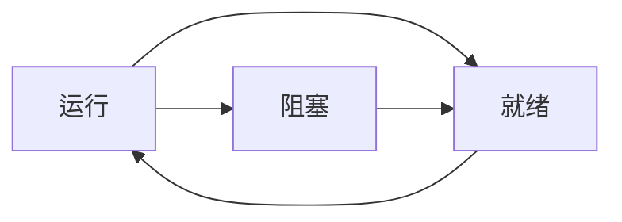

# 课后习题

- 1、图2-2中给出了三个进程状态（，在理论上，三个状态可以有六种转换，每个状态两个。但是，图中只给出了四种转换。有没有可能发生其他两种转换中的一个或两个？

> 答：
就绪->阻塞。阻塞是因为外界原因(比如等待资源)挂起进程，就绪状态下的线程并没有占到CPU资源，因此不会执行任何操作，不会因为任何操作直接进入阻塞。  
阻塞->运行。理论上可行，比如一个进程在完成了I/O，阻塞可以结束，此时可以直接进入CPU执行。但是进程需要通过调度程序控制执行顺序，所以必须经过“就绪”这一准备状态。

- 2、假设要设计一种先进的计算机体系结构，它使用硬件而不是中断来完成进程切换。CPU需要哪些信息？请描述用硬件完成进程切换的工作过程。
> 答：  
用一个寄存器保存指向当前进程的进程表项的指针，进程I/O结束后，CPU把当前的机器状态保存到这个进程表项，然后CPU再通过中断设备的中断向量获取指向另一个进程表项的指针，然后就可以启动这个进程。

- 3、在所有当代计算机中，至少有部分中断处理程序是用汇编语言编写的。为什么？
> 答：  
